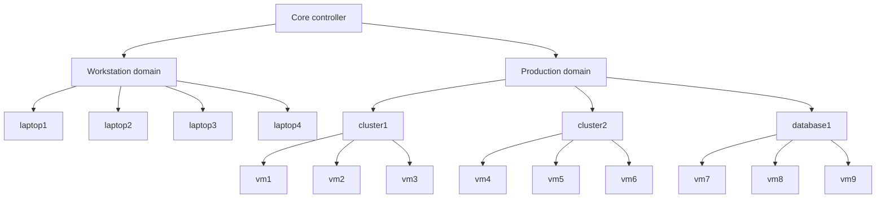
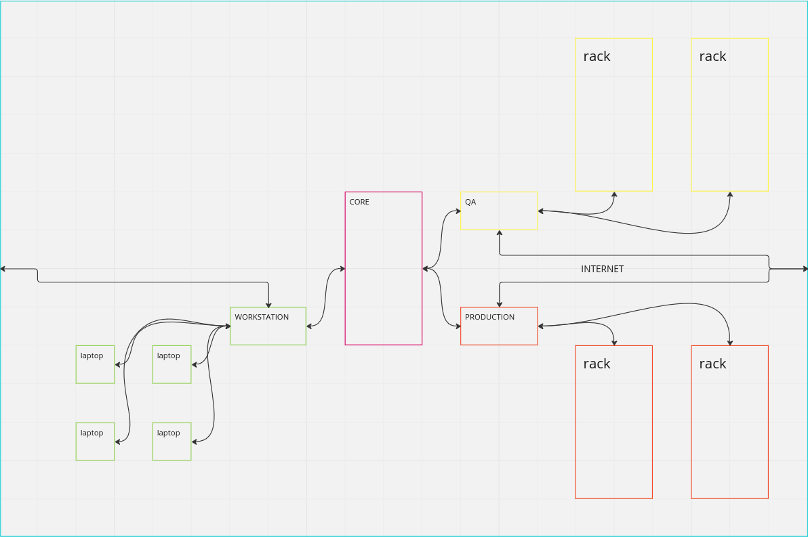

# Sunlight: Your next infrastructure

NOTE: this is an example of a full deployment

## Sunlight

Welcome to Sunlight, the **modern** directory service that **revolutionizes** how you manage and secure your organization's user
and machine identities. Say goodbye to the limitations of traditional LDAP and ADFS, and say hello to a new era of 
security and domain segmentation.

At Sunlight, we believe that security should be at the forefront of any organization's identity management strategy. 
That's why we've built our platform with multiple layers of encryption and cutting-edge techniques such as **TPM2** and 
OpenID to verify both user **and** machine identities.

Our approach to security is just one of the many benefits that Sunlight offers. By combining our platform with an **SDN**, 
you can achieve unparalleled network segmentation in your domains. With Sunlight, you'll have complete control over your 
organization's identity management and security.

Sunlight is a powerful directory service that offers both simplicity and advanced capabilities. With careful planning, 
it can provide significant benefits for your organization, including network segmentation when used with SDN 
technologies. For example, Sunlight can create a secure "session" between a workstation in the WORKSTATION domain and 
a group of machines in the production domain. This session is only available on the workstation and cannot be 
intercepted by other devices on the network. Even if the workstation is compromised while the session is active, 
the security of the production domain remains intact.

Sunlight integrates seamlessly with **WireGuard**, a modern VPN technology that provides exceptional security and 
performance. With Sunlight's direct integration, you can easily configure and manage WireGuard tunnels for secure 
and reliable remote access to your network.

With **WireGuard**, Sunlight ensures that all traffic between the client and server is encrypted and authenticated 
with state-of-the-art cryptographic algorithms. This provides a secure and reliable remote access solution that 
is perfect for distributed teams or remote workers.

Sunlight's integration with **WireGuard** is straightforward, enabling easy setup and configuration. The integration also 
allows for granular access controls and policies, ensuring that only authorized users can access specific resources 
on the network.

Sunlight's direct integration with WireGuard is just one example of how Sunlight provides unparalleled security and flexibility for modern network architectures.

Sunlight is a modern directory service that offers:
- Encryption and multiple layers of security to protect user and machine identities.
- Domain segmentation for improved network security.
- Integration with TPM2 and OpenID to verify both user and machine identities.
- Compatibility with SDN for network segmentation within domains.

To learn more about how Sunlight works, take a look at our detailed [architecture overview](./docs/architecture.md). If you're ready to take your 
organization's security to the next level, give Sunlight a try today.