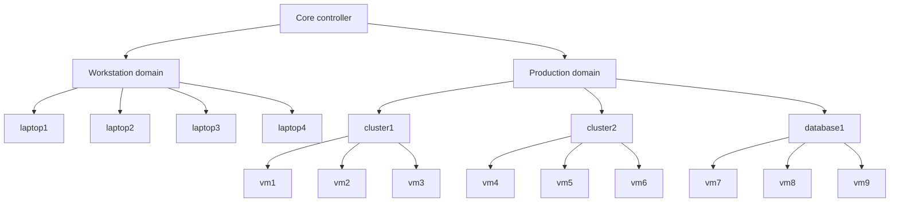
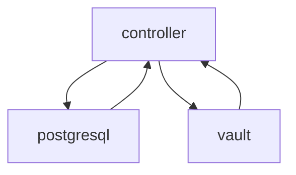
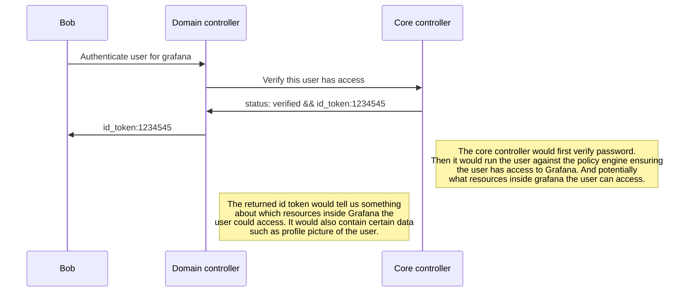
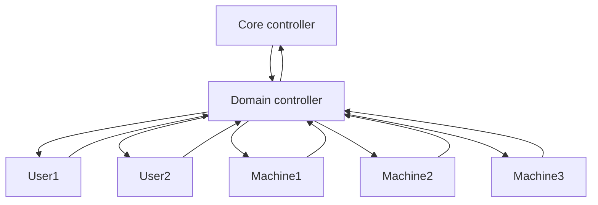
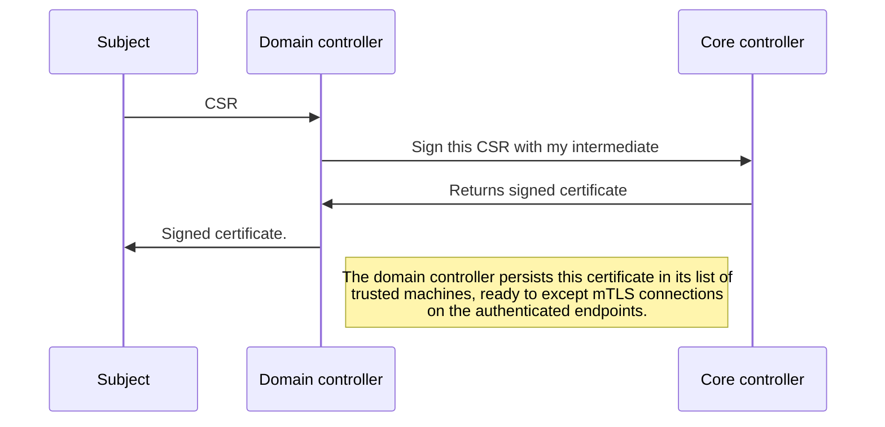

# Sunlight architecture

NOTE: this is an example of a full deployment

## Architecture of the Sunlight Core Controller

The sunlight core controller consists of three elements. A vault instance, a postgresql database and the core controller.
Vault is used for PKI primarily. Vault will manage the certificate of every machine, user and domain controller in the 
whole deployment. Postgresql is obviously the database used by the whole service. It will store all the persistent data
in the system. Data that will primarily be used by the policy engine deployed inside the controller.

### Authentication 

User authentication is an important concept in the system. It is responsible for authenticating users trying to log onto 
their machines in a workstation domain. The same credentials would be used for accessing a print server in the office 
domain. We might want to access Grafana inside our production domain. All of these actions require authentication. The
problem is that each domain might have different authentication requirements. One requirement can be 2FA for example.

This is why the respective domain controller and core controller cooperate on authenticating a user. The domain
controller would manage the clients, for example Grafana. The domain controller would then rely on the core controller
verifying the user and running the request against the policy engine. The core controller would then package the id
token and send it over to the domain controller such that the authentication handshake can finish. If a client is
configured with 2FA, the core controller would be told this by the domain controller and then issue a 2FA procedure as
well.

The authentication system is based on OpenID providing a more modern alternatives to ancient relics such as LDAP. For
backwards compatability a basic LDAP server would be packaged inside the domain controller. But the usage of this server
would not be recommended. The reason OpenID is chosen over LDAP is that most modern services rely on software such
as [Dex](https://dexidp.io) to translate the ldap user and groups into an ID token and or access token.

## Domain controller

The domain controller has various responsibilities. It is responsible for providing the machines in the domain with a
DNS server where the machines will find records and zones which are essential for communicating with its peers. The
domain controller is also responsible for verifying a machines identity and adopting it. As talked about earlier, the 
domain controller also serves a critical role in handling user authentication across the system.

### DNS

A domain controller would package its own DNS, the DNS would only be responsible for serving certain zones in the 
domain. The whole domain itself is a zone, it lives on the FQDN: ``DOMAIN.sunlight.``. If a group of clusters, machines
or databases are grouped together they would also be provided with a zone ``GROUP.DOMAIN.sunlight.``.

The DNS also provides "loopback" records for all the machines to quickly look up information about the domain 
controller. Machines can find these records on the FQDN: ``local.sunlight.``

Each machine would also get its own entry in the zone: ``machines.DOMAIN.sunlight.`` This means the group ``machines``
is reserved for internal use.

Here is a curated list of all special resources.

| FQDN                      | Resource                     |
|---------------------------|------------------------------|
| local.sunlight.           | domain controller (loopback) |
| DOMAIN.sunlight.          | domain zone                  |
| machines.DOMAIN.sunlight. | domain machines zone         |

### Machine verification

For a more detailed look into the technical implemention of the machine verification system please consult the
[domain controller documentation](./domaincontroller.md)

One of the most important features in the Sunlight system is the option to verify not only the users identity but also
the identity of a Machine. This might not be necessary in the datacenter but for portable workstations it is a 
requirement. This feature obviously relies on the tpm2 chip, this is where we would store the private key for both the
machine certificate and wireguard connection. The private keys will live only on the tpm2 and never be read out in 
userspace. 

In some cases a verified machine itself is useless, but when combined with a verified user the workstation could now access 
shared domain resources such as network shares or Agresso. In contrast to a workstation domain, server domains could be 
configured in a way where machine verification is enough to access shared domain resources, to not leak data the grouping 
of the machine would provide the access filtering.

Combining the verification of a machine and the user would provide us with a minimum of two security layers and the 
option to build out more on top. One example of this additional layer could be 2FA.

The adoption of a machine consists of create a CSR (certificate signing request) for the machine and forwarding it to
the domain controller which will ask the core controller to sign the machine with the domain controllers intermediate.
After the machine has been adopted, the domain controller and machine would communicate over a gRPC service which is
encrypted with mTLS. Meaning that the machine must trust the domain controller and the domain controller must trust
the machine.

#### Adoption process

Since all the communication inside the Sunlight system is encrypted regardless, even the adoption process require
certificates. The certificate of the domain controllers adoption server in this case. This certificate lives in a TXT 
record on the loopback DNS resource. This means the Sunlight node software is responsible for grabbing this certificate
before it can start negotiating an adoption.

Once this protocol has been applied the machine should now be trusted by the sunlight system and will be opened for full
access. There is a potential for this machine to be compromised somehow, thus an administrator should be able to
untrust machine and revoke its access to the Sunlight environment.

#### Verification process

Since all authenticated actions on the domain controllers require mTLS there is no need to prove the systems identity
each time it is trying to perform an action. The fact that it can finish the mTLS handshake is enough proof the machine
who it outs to be.