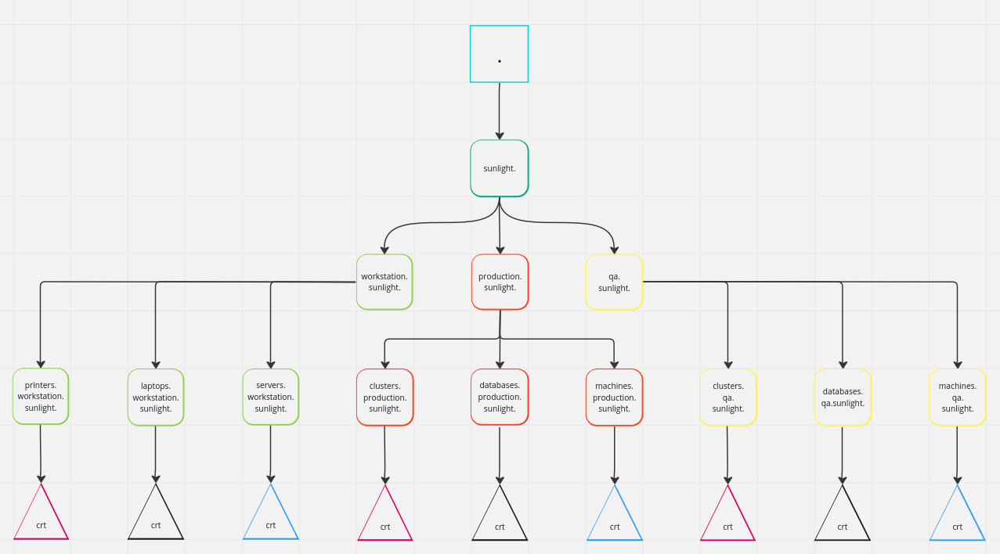
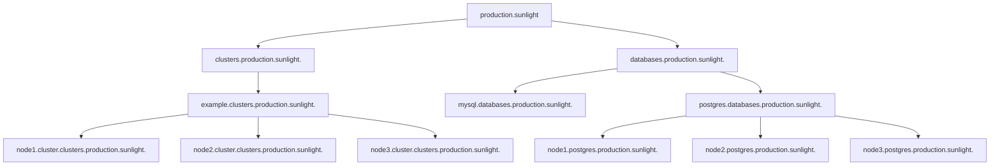
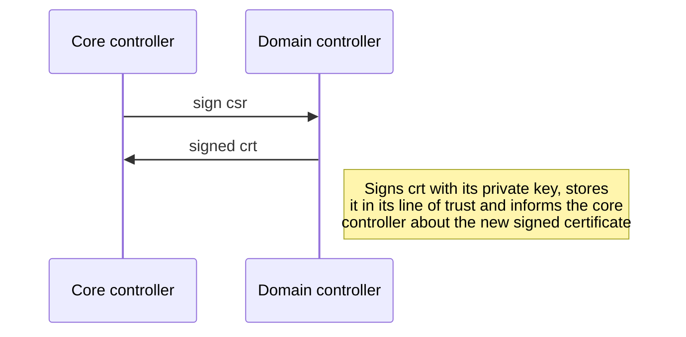
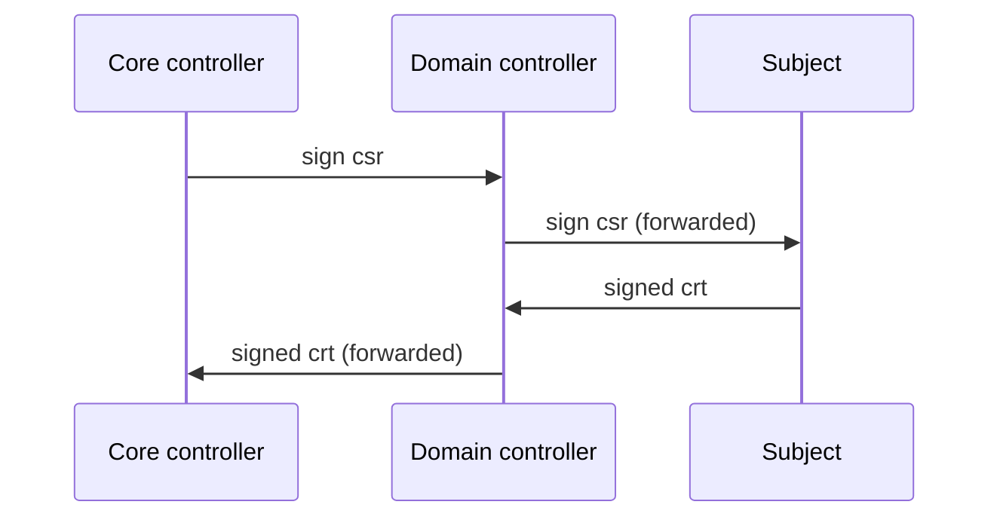

# Certificate chain

The Sunlight system is equipped with a full on certificate authority system. The picture above gives us an idea of how
the authority is constructed. Each rounded square is an intermediate. The special part of this authority is that each
the subject of the certificate is either a DNS record or a DNS zone. All CA certificates reflect a zone in the sunlight 
DNS system. Whereas each certificate is a record inside its parents zone.

The first two certificates in the system pictured above is controlled entirely by the core controller. The root CA has
the common name ``.`` and is intended to be an offline CA. Each node in the environment is expected to trust its 
domain's intermediate certificate. One example of this is a machine in the workstation domain, he would then trust the
``workstation.sunlight.`` domain on the machine. This certificate would facilitate all TLS and mTLS connections a node 
might make.

Each node certificate is expected to be signed by a OU CA. This is also pictured in the above example, a laptop's
certificate is signed by the laptop organizational unit. The laptops common name would then become 
``{{HOSTNAME}}.laptops.workstation.sunlight.``. This common name also depicts the tree based architecture of Sunlight.

Another important example to know is how a cluster certificate might look. By cluster, I mean kubernetes clusters. A 
kubernetes cluster has a bunch of nodes, these nodes are most often physical or virtual machines. The parent of the 
machine would be the cluster certificate operates both as a node certificate and OU certificate. Here is an example of 
a cluster certificate: ``{{CLUSTER}}.clusters.production.sunlight``. A node in the cluster would get the common name:
``{{HOSTNAME}}.{{CLUSTER}}.clusters.production.sunlight.``. The same applies for databases with HA capabilities.

## Distribution

The certificate authority is distributed. Each node of a Sunlight is responsible for its own private key, but the core
controller should always be informed when a new certificate is signed. The core controller can also ask any node under
itself to sign a certificate. The same applies for domain controllers, they can request nodes to sign certificates with
its private key. 

If the core controller asks for a certificate to be signed by the private key of a node inside the domain controllers 
control, the domain controller would then reach out to this node and get the certificate signed. This might be useful
for virtual constructs such as databases or clusters where certificates of the physical nodes need to be signed in to
the hierarchy.

Here both the domain controller and core controller will be informed about the newly signed certificate, so they can add
it into their line of trust and locally stored certificate authority.