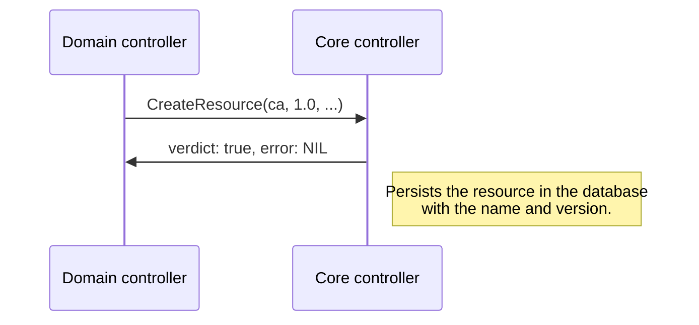
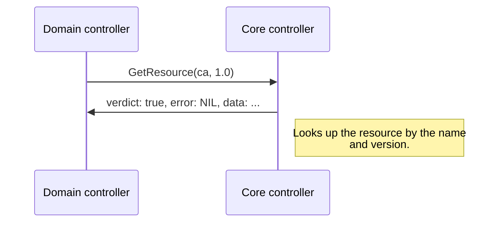
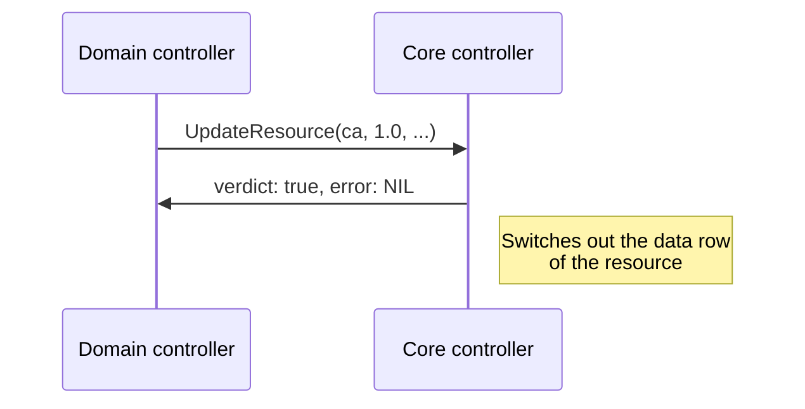

# Core controller

The purpose and basic architecture of the core controller can be found in the
[architecture overview](./architecture.md). Here the internal and more complicated architecture of the core controller
will be explained.

## Services
A core controller is also a combination of multiple services, most notable being the software itself, Postgresql
and HashiCorp Vault. Both the Postgresql and Vault instance are completely internal with no external exposure in 
contrast to the actual core controller. 

| Port   	 | Service 	               |
|----------|-------------------------|
| 1900     | 	 domain gateway (gRPC) |
| 443      | admin dashboard         | 


### Domain gateway

The domain gateway is how domain controller communicate with the core controller. The gateway exposes a standardized
gRPC api. 

#### Resources

The domain controller can request the core controller to persist certain resources in the database. These resources 
might be everything from certificate authority chains or openid clients such as Grafana.

All resources are stored with a name which must be unique to the domain and a version. The actual data is expected to be
json object marshaled to a string.

#### CreateResource



```protobuf
message Resource {
  string id = 1;
  string name = 2;
  string version = 3;

  string data = 4;

  string created_at = 5;
  string updated_at = 6;
}

message CreateResourceResponse {
  bool verdict = 1;
  optional string error = 2;
}

service Core {
  rpc CreateResource(Resource) returns (CreateResourceResponse);
}
```

#### GetResource



```protobuf
message Resource {
  string id = 1;
  string name = 2;
  string version = 3;

  string data = 4;

  string created_at = 5;
  string updated_at = 6;
}

message GetResourceRequest {
  string name = 1;
  string version = 2;
}

message GetResourceResponse {
  repeated Resource resources = 1;
  optional string error = 2;
}

service Core {
  rpc GetResource(GetResourceRequest) returns (GetResourceResponse);
}
```

#### Update Resource

It is important to notice that updating the resource will just switch out the old data row for the new one. Thus the
domain controller is in charge off updating the data correctly.


```protobuf
message Resource {
  string id = 1;
  string name = 2;
  string version = 3;

  string data = 4;

  string created_at = 5;
  string updated_at = 6;
}

message UpdateResourceResponse {
  bool verdict = 1;
  optional string error = 2;
}

service Core {
  rpc UpdateResource(Resource) returns (UpdateResourceResponse);
}
```
