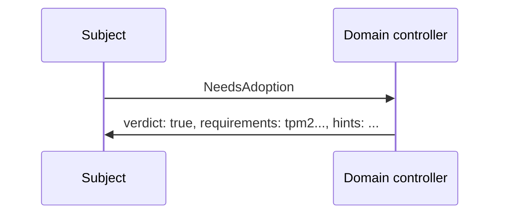
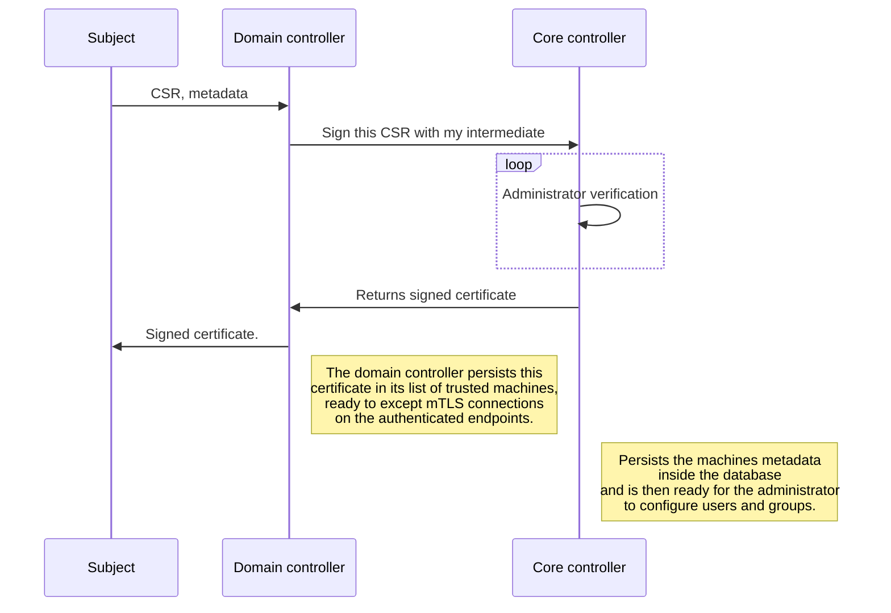

# Domain controller

The purpose and basic architecture of the domain controller can be found in the 
[architecture overview](./architecture.md). Here the internal and more complicated architecture of the domain controller
will be explained.

## Services

A domain controller is a combination of multiple services, most often ran as a single binary where HA is built in. Each
instance of a domain controller is for the most part completely stateless, it relies on the core controller for state.
This is possible since the core controller allows each domain to attach resources on itself. [ref](./corecontroller.md)

| Port   	 | Service 	          |
|----------|--------------------|
| 53	      | 	dns               |
| 2000     | 	 node gateway     |
| 2001	    | 	 adoption gateway |
 | 443      | admin dashboard    | 

### Adoption gateway

The adoption gateway is a gRPC server which is not mTLS. It only requires to client to have the certificate off the
domain controller. The adoption gateway exposed for the most part two rpc to the clients. A client in this context
is a node trying to be adopted by the domain controller.

#### NeedsAdoption

The NeedsAdoption rpc will take a look at the machineid and ask the core controller if this machine is already adopted.
If so it will return a verdict of false and the node controller will start talking on the node gateway. If not, the
domain controller will provide certain hints for the node controller that it can use during the creation of its CSR
(Certificate Signing Request). These hints include properties such as the CommonName, Country, Province, Organization
etc. The domain controller would also return a list of requirements the node would have to meet. One of these could be a
tpm2 chip. If any of these requirements are not met, the machine simply will not be allowed adoption.

Its expected that if there is a tpm2 requirement the RSA private key which is built with 4096 bits to be stored in the
tpm2 under a persistent handle.



```protobuf
message AdoptionHints {
 string common_name = 1;
 string country = 2;
 string province = 3;
 string locality = 4;
 string organization = 5;
 string organizational_unit = 6;
 string email = 7;
}

message NeedsAdoptionRequest {
 // machine_id can be found in /etc/machineid on all systemd based systems. Other operating systems probably
 // also provide a solution for this.
 string machine_id = 1;
}

message NeedsAdoptionResponse {
 bool verdict = 1;
 AdoptionHints hints = 2;
 repeated string requirements = 3;
 optional string error = 4;
}

service Adoption {
  rpc NeedsAdoption(NeedsAdoptionRequest) returns (NeedsAdoptionResponse);
}
```

#### Adopt

There is no technical way to prove a machine could uphold certain requirements, it would have to be a trust you put into 
the node controllers.

When a machine requests an adoption, it would send down its machineid, machine metadata and 
CSR (Certificate Signing Request). The domain controller would forward this message to the core controller where the
certificate would be signed and the machine would be persisted. The core controller would return a signed certificate to
node/machine. On the way back, the domain controller would trust the domain of the node thus allowing the mTLS traffic 
to start flowing.  



```protobuf
message MachineMetadata {
  // core count, bandwidth, memory etc. kernel version, os (/etc/os-release)
}

message AdoptRequest {
  string machineid = 1;
  MachineMetadata metadata = 2;
  repeated string fulfilled_requirements = 3;
  string csr = 4;
}

message AdoptResponse {
  bool verdict = 1;
  string certificate = 2;
  optional string error = 3;
}

service Adoption {
  rpc Adopt(AdoptRequest) returns (AdoptResponse);
}
```

This whole adoption process could be automated. You could configure it in such a way that each adoption request in a
specific domain is automatically accepted. You could do this because you could make assumptions about the security
of the hardware the domain is connected too. Such as a datacenter, someone would need physical access. Plug a machine
into a network port and pray it is wired into the domain controller. Other than that you need access to the virtual 
machine host to establish a new adoption in the system. These are examples of steps you can take to remove the manual
part of verifying the machine.